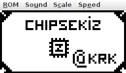
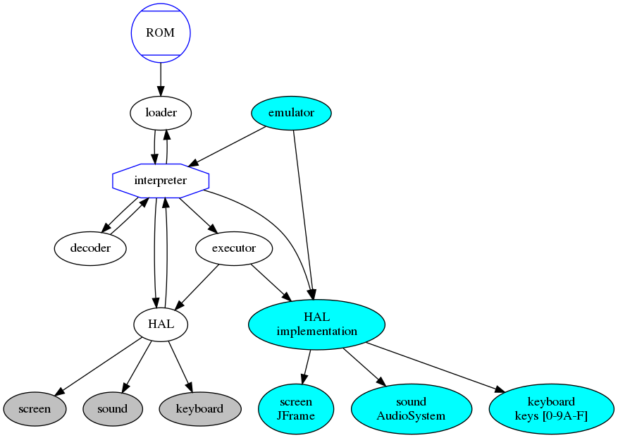

# chipsekiz - CHIP-8 emulator

A [CHIP-8](https://en.wikipedia.org/wiki/CHIP-8) interpreter and emulator in java.



## Quick Start

This repository contains two different projects, the [chipsekiz interpreter](chipsekiz) and the [emulator](emulator-awt) implemented in Java.

To build them both and run the **CHIP-8** emulator:

```bash
mvn clean install
java --enable-preview -jar emulator-awt/target/emulator-awt-1.0-SNAPSHOT-jar-with-dependencies.jar
```

To emulate **SuperCHIP-8**:

Select `SuperCHIP-8` from the VM menu or start the emulator with:

```bash
java --enable-preview -jar emulator-awt/target/emulator-awt-1.0-SNAPSHOT-jar-with-dependencies.jar --superchip8
```

Emulator will launch the chipsekiz demo ROM with the memory debug view, you can load other ROMs from the menu.

Java 14 is required.

## Testing

To run all unit tests use:

```bash
mvn test
```

Among other tests, `InterpreterTest#testRunRoms` executes included [ROMs](roms) and prints their framebuffer contents to console.

Random selection of test ROM renders from [chipsekiz/docs/rendered](chipsekiz/docs/rendered):

   

   -cycle213.png>)

   

   

---

Some classical ROMs and some of the newer ROMs from Octo archive @ https://johnearnest.github.io/chip8Archive/ are included in the [repository](roms).


## Architecture

The interpreter consists of a loader, a decoder, an executor and a HAL (hardware abstraction layer) working in unison:



Loader creates a memory image from multiple layout sections which includes the program section and may include a character sprites section. The created memory image is fed into a new VM, inside the interpreter instance. Interpreter interacts with the HAL to get the keyboard status, play a sound and to draw to the screen.

The emulator speed-limits the `Interpreter#tick` invocations to match the CPU speed expected by the ROMs and provides a custom HAL to the interpreter which display a `JFrame`.

## Implementation

#### Loader

`Loader` builds a memory image from zero or more sections and the program (ROM) itself. Sections have a start address and can include data or code, e.g. character sprites are a data section. Overlapping sections are not allowed.

#### Decode

`Decoder` reads a 2-byte word and according to a specific ISA, currently only [CHIP-8 Wikipedia description](https://en.wikipedia.org/wiki/CHIP-8), decodes bytes to an `Opcode` instance or if it is not possible to a `DataWord` instance.

#### Executor

`Executor` sits between the `Interpreter`, `VM` and the `Decoder`. `Interpreter` would send successfully decoded opcodes to the `Executor`. When HAL access is required, e.g. to check the pressed key, `Executor` invokes `IHal` methods. After executor returns, `Interpreter` is free to fetch and decode the next instruction.

#### VM

`VM` contains the memory, registers, callstack and sound and delay timers. `VM` does not contain any execution logic, only provides the data model of the virtual machine.

#### HAL

`HAL` encapsulates each type of interaction that requires hardware communication, such as drawing to a screen, playing sound and detecting keyboard state. `FramebufferHal` implementation makes the interpreter testable and is used from `InterpreterTest#testRunRoms` test, providing an in-memory Hardware Abstraction Layer.

#### Interpreter

`Interpreter` orchestrates all of the interaction between the `Loader`, `VM`, `Decoder`, `Executor` and `HAL`. First it loads the program and creates the VM with the program and an origin. At every `Interpreter#tick`, it would run a [fetch-decode-execute](https://en.wikipedia.org/wiki/Instruction_cycle) cycle, decrease the [sound and delay timers](https://en.wikipedia.org/wiki/CHIP-8#Timers) and update the sound state.

`Interpreter` has a primitive halt detector. CHIP-8 does not have a [halt instruction](<https://en.wikipedia.org/wiki/Halt_and_Catch_Fire_(computing)>) so when the ROM programmer wants to finish the program and keep what is on the screen, the program would enter an infinite loop.

Entering an infinite loop with a single instruction effectively preserves the screen content and disables the keyboard and sound (after its timer runs out). Halt detector only updates the interpreter status to `BLOCKED` for awaiting keyboard input or `HALTED` if an instruction jumps to itself, i.e. simplest infinite loop. An infinite loop with more than one instruction is not detected. Halt detector and interpreter status is used in unit tests when interpreting the [ROMs](src/test/resources/roms).

To execute an instruction, `Interpreter` fetches an instruction from the memory pointed by the PC (program counter) register, and PC would be incremented by 2, which is the instruction width for this architecture, same for all opcodes. This 2-byte fetched instruction would then be decoded. If it is not a valid opcode for a given `IDecoder`, `Interpreter` would throw a _cannot execute data_ exception, otherwise it would be executed with the help of `IExecutor` and `IHal`.

If there is an `ITracer` instance in the `Interpreter`, all executed opcodes would be reported to it.

Optional `IDebugger` instance receives notifications of memory and register changes.

`InterpreterTest` executes included ROMs via `Interpreter` until they halt or until they ran for 600 (arbitrary) instruction cycles, whichever is first.

#### SuperCHIP-8

SuperCHIP-8 components live in the [dev.krk.chipsekiz.superchip](chipsekiz/src/main/java/dev/krk/chipsekiz/superchip) package. It has a decoder, a hal, an interpreter and a vm, all of which are extended from CHIP-8 components.

#### Using the library

To create a default instance of the `Interpreter`:

```java
// 1NNN instruction, used as 0x1200 which jumps to 0x200, passed as origin to the interpreter below, causing an infinite loop.
byte[] program = {0x12, 0x00};
FramebufferHal hal = new FramebufferHal(64, 32);
Interpreter interpreter =
            new Interpreter(loader, decoder, executor, fbhal, Optional.empty(), 0x200, program,
                0x1000, CharacterSprites.DefaultLayout());

for(; /* emulator loop */ ;) {
    // 1. Forward hardware state to Hal, such as the pressed key.
    // 2. Tick the interpreter.
    // 3. Update the screen by rendering (FramebufferHal#renderFramebuffer) or directly from your own IHal implementation.
    // 4. Switch sound on or off by getting FramebufferHal#isSoundActive or in response to IHal#sound.
}
```

Using the `ChipVariationFactory` with preset options:

```java
FramebufferHal hal = new FramebufferHal(64, 32);
IChipVariation variation = ChipVariationFactory.createChip8(hal);
IInterpreter interpreter = variation.getInterpreter();

// 1NNN instruction, used as 0x1200 which jumps to 0x200, passed as origin to the interpreter below, causing an infinite loop.
byte[] program = {0x12, 0x00};
interpreter.load(0x200, program)

/* emulator loop */
{
    interpreter.tick();
}
```
__
## Further direction

- Add VM save and load snapshot feature - save game support for all kinds of programs.
- Implement other variations of CHIP-8, i.e. CHIP-48, hires, Super CHIP-8 etc.
- Implement single-step debugger
- Support loading [Octo](https://github.com/JohnEarnest/Octo) "cartridges" from animated gif files.

## References

- CHIP-8 ISA: https://en.wikipedia.org/wiki/CHIP-8
- Super CHIP-8: http://devernay.free.fr/hacks/chip8/schip.txt
- Opcode mnemonics: http://devernay.free.fr/hacks/chip8/C8TECH10.HTM
- Octo assembler and emulator: https://github.com/JohnEarnest/Octo
- Octo shared ROMs https://johnearnest.github.io/chip8Archive/
- ROMs collected from multiple sources:
  - https://github.com/loktar00/chip8
  - https://www.zophar.net/pdroms/chip8/chip-8-games-pack.html
  - https://github.com/dmatlack/chip8
  - https://github.com/GuillaumeGas/Chip8
  - https://johnearnest.github.io/chip8Archive
